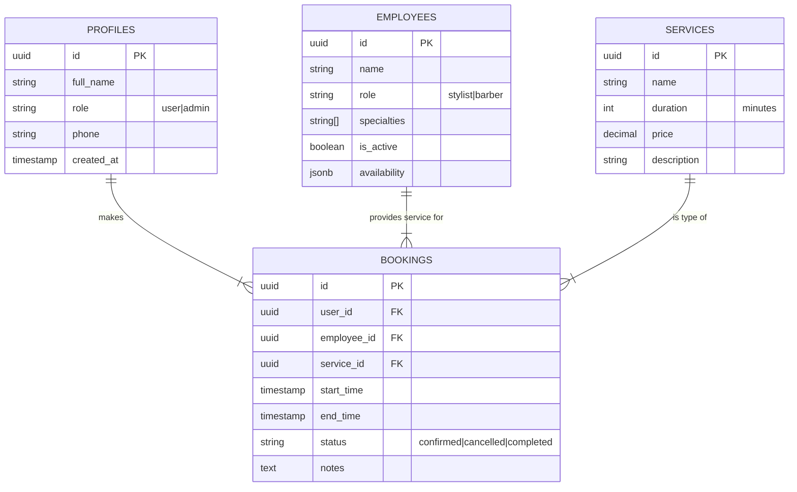

# 🗄️ Database Schema & Security

The application runs on a Supabase (PostgreSQL) backend. This document outlines the core tables and security policies.

## Entity Relationship Diagram



## Security Policies (RLS)

### Profiles

- **Select**: Users see their own; Admins see all.
- **Update**: Users update their own; Admins update all.

### Bookings

- **Select**: Users see their own; Admins see all; Employees see their assigned.
- **Insert**: Authenticated users can create bookings.
- **Update**: Users can cancel their own pending bookings; Admins can update any status.

### Employees & Services

- **Select**: Public (Everyone can view available services and staff).
- **Update/Insert/Delete**: Admin only.

## Data Types

### `availability` (JSONB)

Stores simple working hours structure:

```json
{
  "monday": ["09:00", "17:00"],
  "tuesday": ["09:00", "17:00"]
}
```

### `role` (Enum)

- `user`: Standard customer.
- `admin`: Business owner with full dashboard access.
